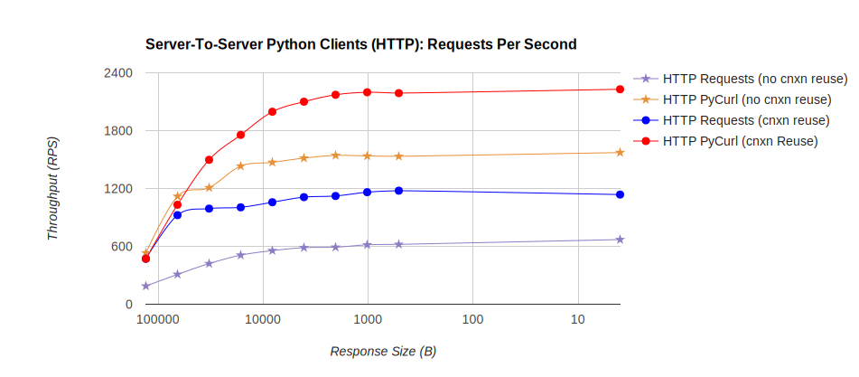
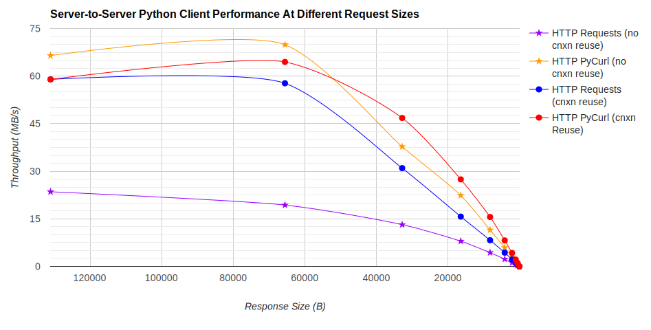
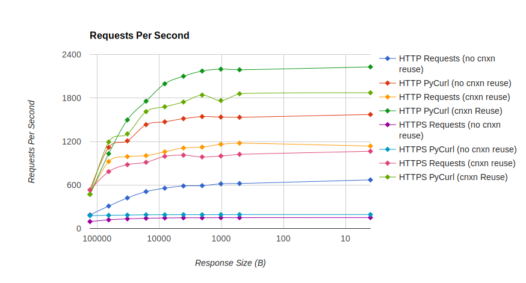
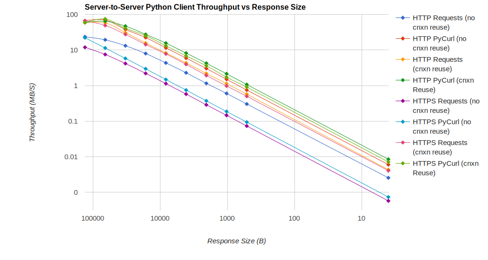

# python-client-benchmarks

Benchmarking different python HTTP clients, using a small, high-performance sample API. 

# Why?

To answer the question: how much does performance differ, for python HTTP clients?

This provides a Python client library benchmarking tool and a simply but high-performance API (HTTP and HTTPS) to use in benchmarking.

Oh, and of course, results in a controlled environment!

# How do I run the test server?
In one terminal:
* docker run --rm -i -t -w /tmp -p 4443:443 -p 8080:80 svanoort/client-flask-demo:2.0
* OR: (sudo) ./build-docker.sh && ./run-docker.sh

The test server will expose several API endpoints, with HTTP responses on port 8080 & HTTPS (self-signed cert) on port 4443:
* /ping - returns "pong"
* /bigger - returns a fixed ~585B JSON response
* /length/\<integer\> - returns a fixed-length random binary response of $integer bytes. The first time this is generated and cached, then it is served from cache.

# How do I run the benchmark client?
It's a command line utility, and has help via "python benchmark.py -h"
python benchmark.py http://host:port/

# How
1. On one server or system 

1. In one terminal, build & run the docker image to start a test server: `sh build-docker.sh && sh run-docker.sh`
2. In another terminal, run: python benchmark.py --cycles 10000
3. Tests take a few minutes minute to finish, then you can close process in terminal 1. 

# Short Summary of Results

PyCurl is much faster than Requests (or other HTTP client libraries), generally completing smaller requests 2-3x as fast, and requires 3-10x less CPU time.  This is most visible with connection creation for small requests; given large enough requests (above 100 kB/s), Requests can still saturate a fast connection quite easily even without concurrent HTTP requests (assuming that all post-request processing is done separately) on a fast CPU.

# Benchmark Setup

Testing with two c4.large instances in AWS, one running a client, and the other running the server. 
For loopback tests, both are run on the same (client) system. 
Logs were collected from each benchmark run, along with vmstat dumps to verify that the CPU was never fully loaded (and never a bottleneck).

Specs: 

* Amazon Linux (Fedora-based), latest update and all updates installed as of 26-Feb-2016.
* Enhanced networking, [one source](https://developer.washingtonpost.com/pb/blog/post/2015/12/02/running-network-constrained-applications-on-ec2/) suggests the c4.large has ~517 Mbps of bandwidth per host
* 2 vCPUs, Intel Xeon E5-2666 v3 or equivalent (8 ECU)
* 3.75 GB of RAM
* 8 GB GP2 EBS volume

# Graphs

# Detailed Results

Loopback  Test, running on 1 c4.large and making 1 kB requests against a local server

| Request Type, Loopback Tests                                                    | RPS HTTP        | RPS HTTPS       |
|---------------------------------------------------------------------------------|-----------------|-----------------|
| requests, reuse cnxns: False,  options: Default                                 | 557.3155949917  | 146.2831102504  |
| requests, reuse cnxns: True,  options: Default                                  | 1070.6839916342 | 1008.8823802972 |
| pycurl, reuse cnxns: True,  options: Reuse handle, don't save body              | 2247.4874466776 | 1882.3429728577 |
| pycurl, reuse cnxns: True,  options: Reuse handle, save response to new buffer  | 2216.451621972  | 1872.04671333   |
| pycurl, reuse cnxns: False,  options: Reuse handle, save response to new buffer | 1442.8205461881 | 189.3355681677  |
| pycurl, reuse cnxns: False,  options: New handle, save response to new buffer   | 1406.1161485093 | 188.6946363771  |
| urllib3, reuse cnxns: True,  options: Default                                   | 1314.916432521  |                 |
| urllib, reuse cnxns: False,  options: Default                                   | 902.8386556557  |                 |

# Miscellanea
build-docker.sh was used to generate the docker image
./run-docker.sh will launch the container